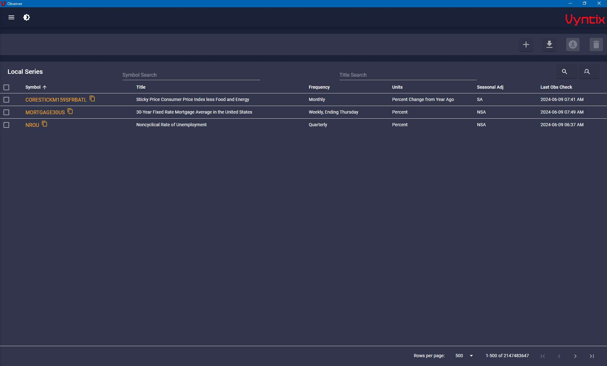
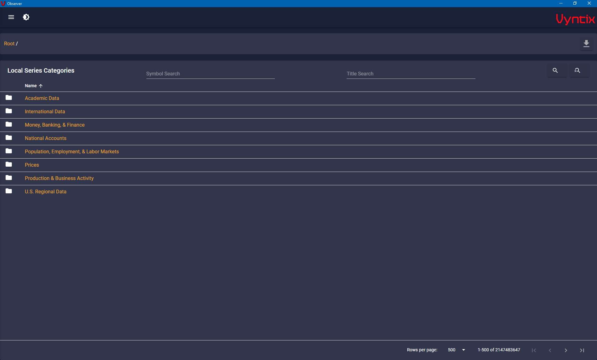
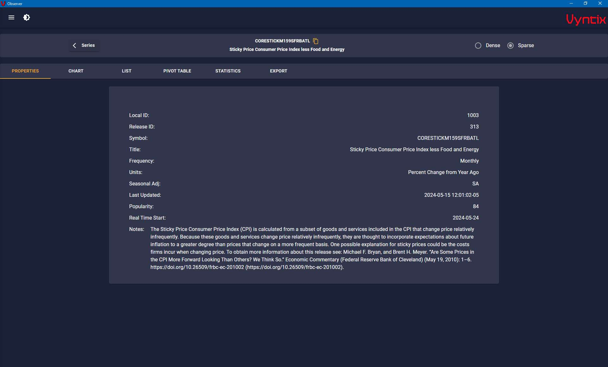
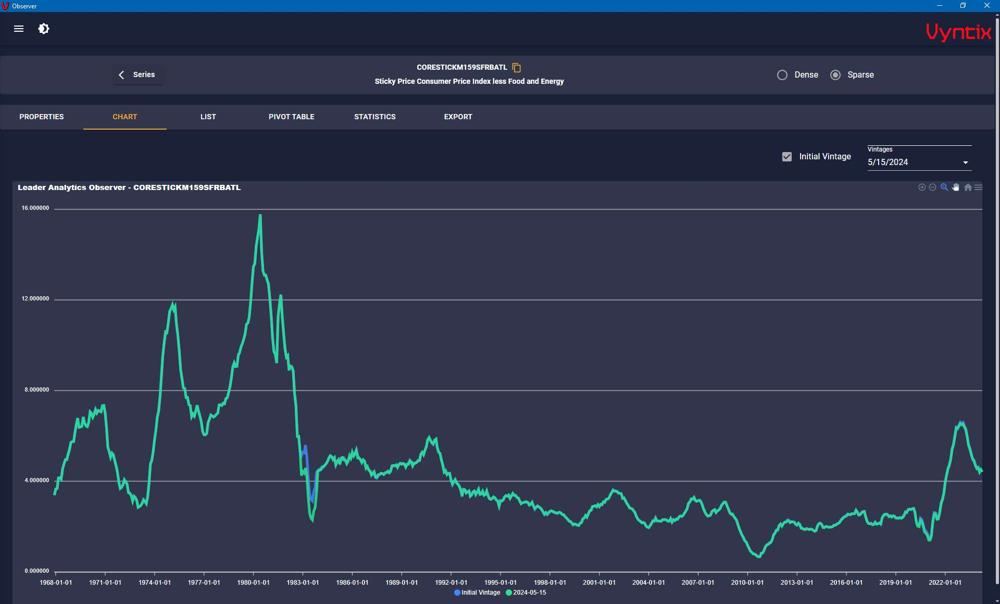
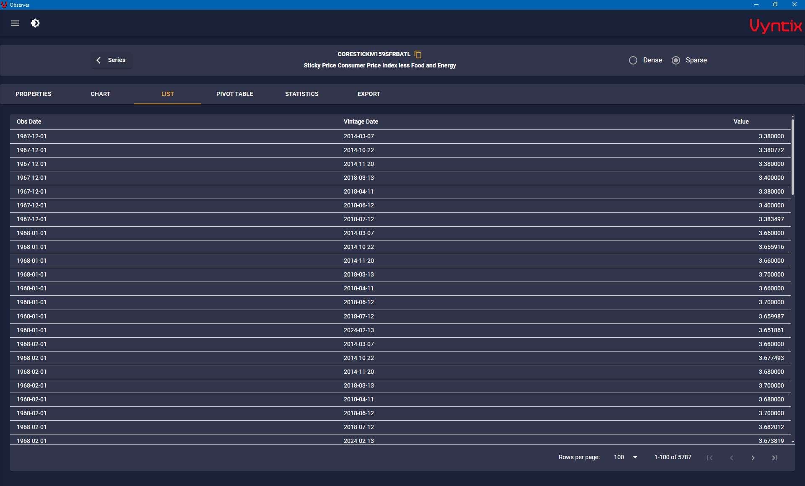
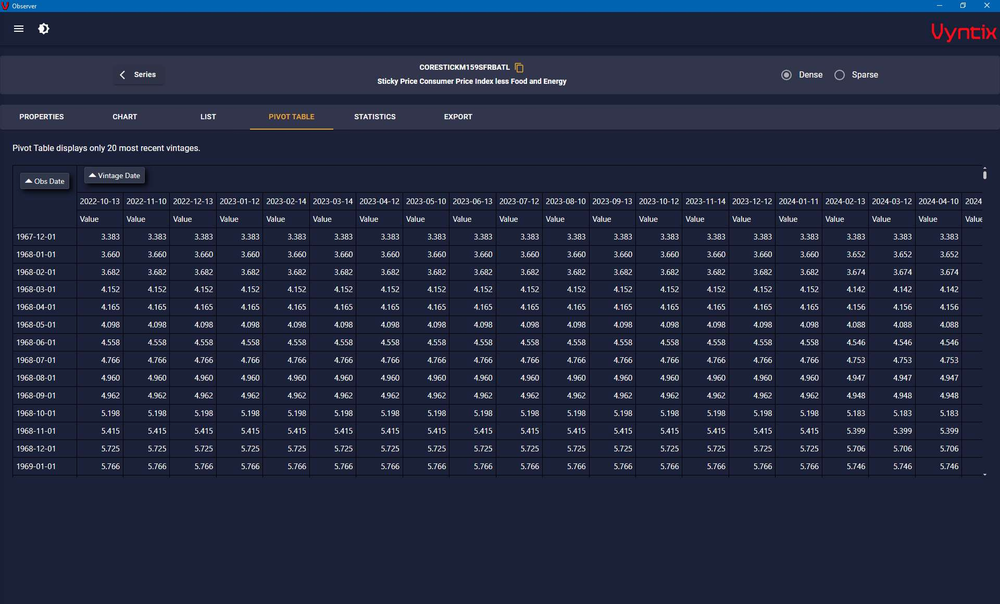
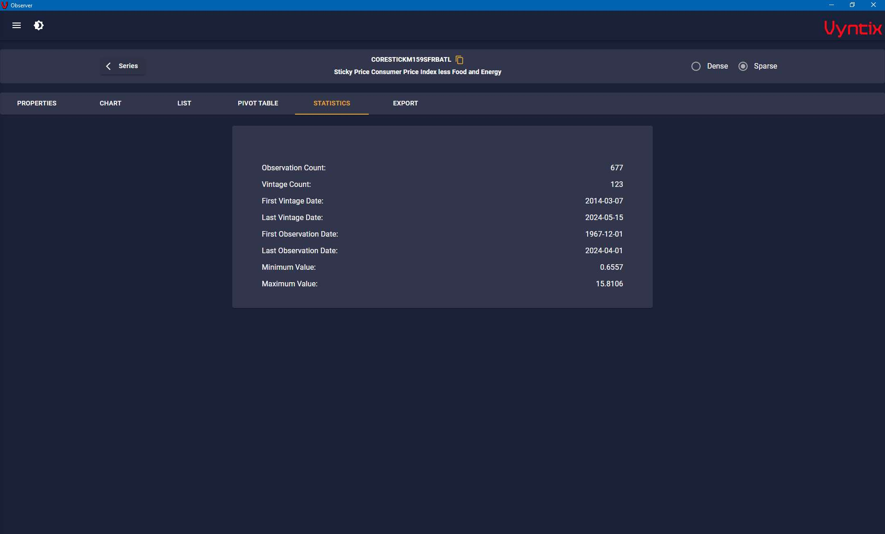
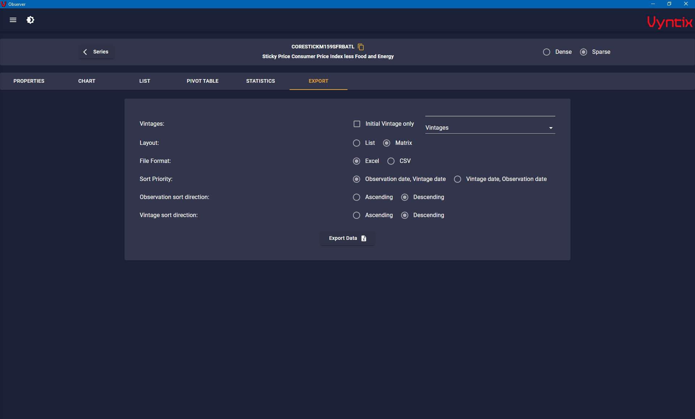

Observer Desktop is a utility for downloading data from the St. Louis Federal Reserve Bank [FRED API](https://fred.stlouisfed.org/docs/api/fred/) and saving it in a database on your local desktop or laptop machine.

Observer Desktop Windows Installer can be downloaded from the [Vyntix website](https://vyntix.com/Downloads).

Observer Desktop has powerful export features that allow you to export data from your local database to an Excel or CSV file. You can export vintage data in list or matrix format.

Series can be viewed in list format or in a hierarchical format by FRED category.

The program downloads the following data elements: Series meta data, observations, vintages, series tags, releases, release dates, sources, child categories, related categories, category tags.

Observer Desktop contains features that allow you view data as a list, a matrix (pivot table), or a graph. You can quickly view properties of a series such as frequency and units. Data can be viewed (and exported) in sparse or dense format. Sparse format contains only data that is changed for each vintage. Dense format repeats unchanged data from prior vintages. Dense data is often easier to work with in a spreadsheet and is sometimes easier to visualize.

NOTE: In order to use Observer Desktop you must install a Database management system (DBMS) such as Microsoft SQL Server or MySQL on your machine, or you must have access to a DBMS on your local area network. See the [documentation](https://vyntix.com/docs/intro.html) for more detail .

If you prefer a command line interface for batch or scheduled data updates, try [Observer CLI](https://github.com/leaderanalytics/Observer.CLI).  Both Observer Desktop and Observer CLI are ased on the the powerful [Vyntix Fred Client](https://github.com/leaderanalytics/Vyntix.Fred.FredClient) which is used to access the FRED API.  

